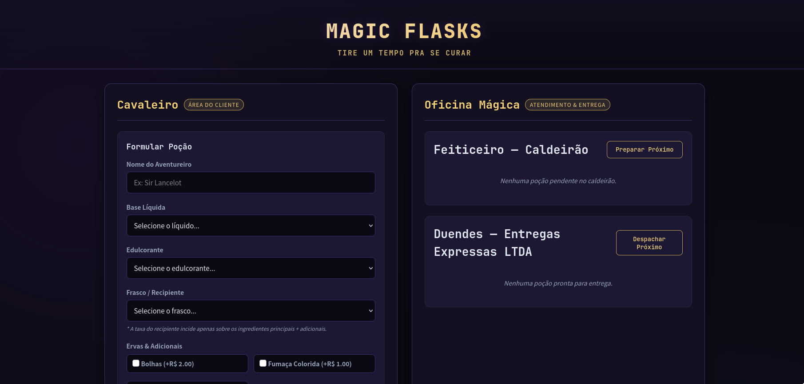
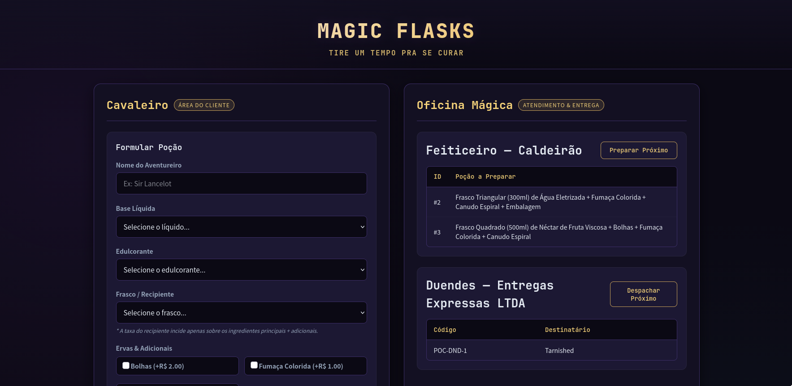
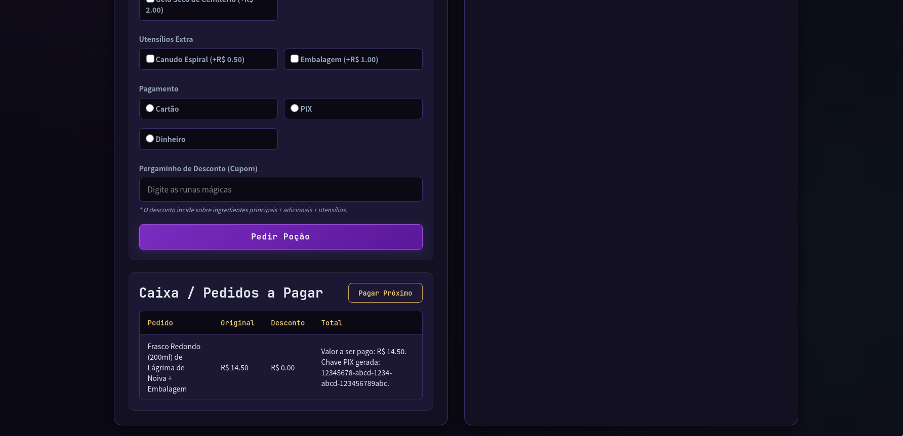

# Magic Flasks

Sistema para criação de pedidos de poções mágicas. Feito para a cadeira de Padrões de Projetos de Software (Design Patterns) da faculdade.



## Tecnologias Usadas

- TypeScript
- Preact
- Vite
- Google Gemini (para algumas ideias e estilização da interface)

## Design Patterns Usados

Foram usados 5 design patterns para fazer o sistema.

#### Builder - Criacional
- Monta a poção básica com seus adicionais opcionais. Foi utilizado pois é uma forma dinâmica de criar o produto principal (que é complexo) conforme as escolhas do cliente sem criar construtores gigantes.
- Aplicado em `src/core/builders` no arquivo `PocaoBuilder.ts`.

#### Decorator - Estrutural
- Adiciona utensílios para a poção, como canudo e embalagem. Foi utilizado pois é uma forma de adicionar novas informações ao produto principal sem modificar a classe original e nem criar subclasses extras.
- Aplicado em `src/core/decorators` nos arquivos `base/UtensilioDecorator.ts`, `CanudoDecorator.ts` e `EmbalagemDecorator.ts`.

#### Strategy - Comportamental
- Define o pedido com a forma de pagamento e desconto por cupom. Foi usado pois é uma forma de simplificar a integração com diferentes maneiras de fazer a mesma ação (pagar ou aplicar desconto), permitindo trocar o algoritmo utilizado sem precisar modificar a classe principal do produto toda vez.
- Aplicado em `src/core/strategies` nos arquivos `DescontoCupomStrategy.ts`, `PagamentoCartaoCreditoStrategy.ts`, `PagamentoDinheiroStrategy.ts` e `PagamentoPIXStrategy.ts`.

#### Singleton - Criacional
- Cria 3 listas ordenadas de pedidos, contemplando pedidos pendentes, pagos e prontos. Também foi feito um Repository para dados fixos que usa esse padrão (pois não há banco de dados). Foi usado pois tanto a lista de pedidos quanto o repositório de dados podem ser usados em diversos pontos do sistema e eles não podem apresentar informações diferentes nem utilizar recursos desnecessários para mapeamento.
- Aplicado em `src/services` e `src/repositories` nos arquivos `FilaPedidos.ts` e `CatalogoRepository.ts`.

#### Adapter - Estrutural
- Cria um adaptador para a biblioteca externa de entregas dos duendes para os pedidos. Foi usado por se assemelhar com situações reais em que as empresas de transporte tem seus próprios sistemas e muitas vezes é necessário fazer integrações complexas para tudo funcionar.
- Aplicado em `src/core/adapters` e `src/externals` (simulando a biblioteca externa) nos arquivos `EntregaDuendeAdapter.ts` e `EntregasDuendesLTDA.ts`.

Além disso, por todos se integrarem no mesmo sistema, há resquícios de cada um nas classes `src/core/Pedido.ts` e `src/core/Pocao.ts` e também no arquivo `src/App.tsx`.

## Instalação e Uso

Para instalar o projeto é muito simples. Basta já ter o NodeJS e NPM instalados no computador e, estando na pasta em que fez o download do projeto, abrir o terminal/cmd e executar os seguintes comandos para instalar as dependências:

```bash
cd magic-flasks
npm i
```

Após isso, ainda estando na pasta `magic-flasks`, basta executar o seguinte comando no terminal/cmd para rodar o projeto no modo de desenvolvimento:

```bash
npm run dev
```

Se tudo deu certo, o sistema irá estar rodando em `http://localhost:5173`. Essa informação irá aparecer no terminal também.
<br>
Nesse projeto só ensino a rodar em modo de desenvolvimento, mas é possível usar o Vite para a criação de uma build super leve do sistema.

## Exemplos

Ao rodar o projeto no navegador, o resultado esperado é parecido com os exemplos visuais abaixo:

### Parte superior da tela


### Parte inferior da tela

